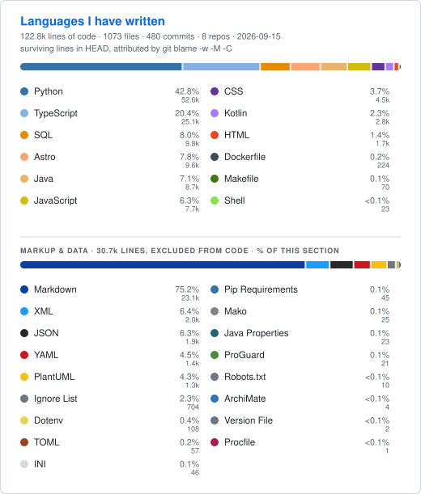

<picture>
  <source media="(prefers-color-scheme: dark) and (min-width: 1012px)" srcset="./profile/langs-dark-wide.svg">
  <source media="(prefers-color-scheme: dark)" srcset="./profile/langs-dark.svg">
  <source media="(min-width: 1012px)" srcset="./profile/langs-light-wide.svg">
  
</picture>

Computed locally across public and private repos: it counts the lines in
`HEAD` that `git blame` attributes to my commit identities, discarding
dependencies, lockfiles, minified files and generated code. It is not how big my
repos are, it is the code I wrote that is still alive.
